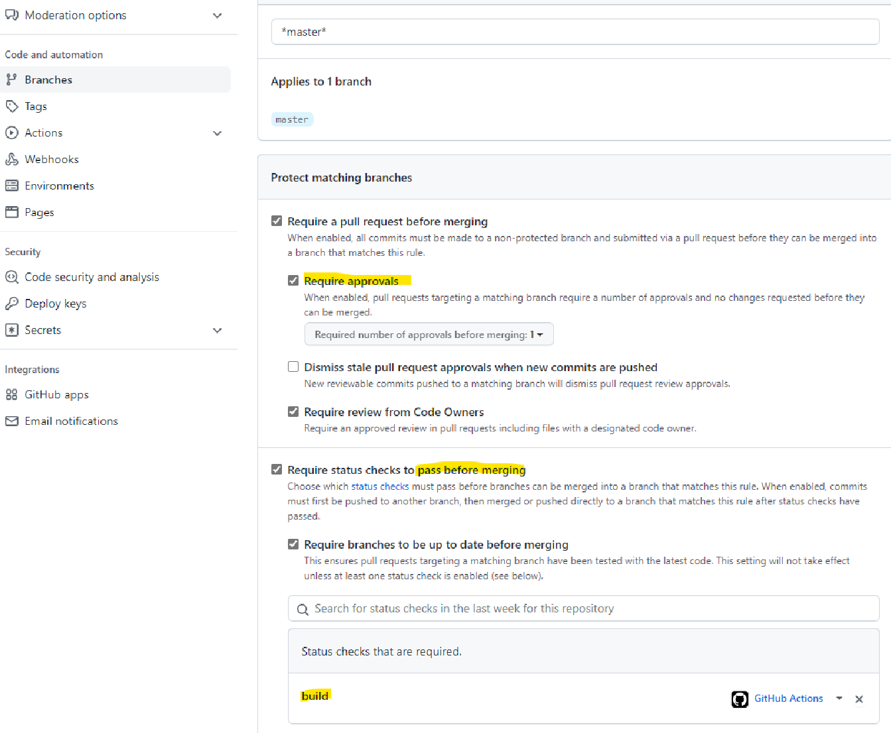

= Getting Started

* This project is based on Spring Boot and React JS.
* How to automatically create images and deploy in docker-hub using maven.
* How to deploy a Spring Boot in AWS ElasticBeans.
* How to create Git actions to automatically build and deploy in AWS.

== web:

 http://fullstack-env-1.eba-c2q4pxum.us-east-1.elasticbeanstalk.com/

== ReactJS

* Useful links

 https://nodejs.org/en/
 https://reactjs.org/
 https://www.npmjs.com/package/create-react-app
 https://github.com/facebook/create-react-app

* Useful checks and Commands

 node -v
 npm -v
 npx -v
 npm -g i npx = to install npx

* On the Spring project, to create the project

 cd src
 npx create-react-app frontend
 cd frontend
 git:(master) rm -rf .git = to remove git files

* Framework to develop react UI
- Ant design to build UI

 https://ant.design/
 https://react-bootstrap.github.io/
 https://ant.design/docs/react/use-with-create-react-app

- Command

 cd .\src\frontend\
 npm install --save antd@

- Add in app.css

 @import"~antd/dist/antd.css";
 @import"~antd/dist/antd.dark.css";
    Ref: https://github.com/ant-design/ant-design-dark-theme/

- Add in app.js

 import{Button}from"antd";

- To install icons

 npm i -S @ant-design/icons

* Unfetch
- Ref: https://github.com/developit/unfetch
- Used to do rest request, to install

 npm i -S unfetch

- Control fetching. Ref: https://17.reactjs.org/docs/concurrent-mode-suspense.html
- Proxy, add proxy in package.json to avoid write it for the rest requests

 "proxy":"http://localhost:8080"

* Start

 cd src/frontend/
 npm start

== Maven Plugins

* com.github.eirslett
- Front end maven plugging
- Used to get the built front end and place it into a java project
- Ref: https://github.com/eirslett/frontend-maven-plugin

* maven-resources-plugin
- Used to copy resources

* To do not display maven download

 --no-transfer-progress

== Docker and Jib vs com.spotify

* Jib
- https://github.com/GoogleContainerTools/jib
* To deploy in dockers
* To run a container locally then push
* No need to have docker locally (Deamon-less)
* OCI - Open container initiative

 ./mvnw compile jib:dockerBuild
 ./mvnw clean install jib:dockerBuild

* Commands
- To run container

 docker run --name fullstack -p 8080:8080 jcorderop/fullstack

- To delete container with name fullstack

 docker rm -f  jcorderop/fullstack

- To view local images run

 docker image ls or docker images

- To view running containers

 docker ps

- To push

 docker login
 ./mvnw clean install jib:build
 ./mvnw compile jib:build

* Custom profiles

 ./mvnw help:active-profiles
 ./mvnw clean install -P build-frontend -P jib-push-to-dockerhub

== Error handling
* To propagate errors from spring

 server.error.include-message=always
 server.error.include-binding-errors=always

* Bean validation
- Dependencies: spring-boot-starter-validation
- Ref: https://www.baeldung.com/spring-boot-bean-validation
- Has to be added in the entity
- has to be added in the post request method parameters
    @Valid

== JUnit 5
* assertJ
- Improve assert methods
- Ref: https://assertj.github.io/doc/
- **ArgumentCaptor** is used to test what is expected to be executed

* Unit test Coverage

 More Run/Debug with coverage

* Maven Fail-safe plugging
- Is Already part of the spring boot
- To trigger HTTP requests

* Faker
- to create random data
- Ref: https://github.com/DiUS/java-faker

== AWS
* Elastic Beanstalk
- End-to-end web application management.
- Amazon Elastic Beanstalk is an easy-to-use service for deploying and scaling web applications and services developed with Java, .NET, PHP, Node.js, Python, Ruby, Go, and Docker on familiar servers such as Apache, Nginx, Passenger, and IIS.
- Links

 https://docs.docker.com/compose/
 https://docs.docker.com/compose/compose-file/compose-file-v3/

* EC2 -> Instances
- To see instance running

* Database
- Choice db.t2.micro
- Then configuration -> database

* Postgres
- Ref: https://hub.docker.com/_/postgres

* Create network

 docker network create db

* Create volume

 WINDOWS USER use %cd% instead of "$PWD"
 docker run --name db -p 5432:5432 --network=db -v "%cd%:/var/lib/postgresql/data" -e POSTGRES_PASSWORD=password -d postgres:alpine

1. create a folder to mount /var/lib/postgresql/data
2. cd into that folder
3. docker run --name db -p 5432:5432 --network=db -v "%cd%:/var/lib/postgresql/data" -e POSTGRES_PASSWORD=password -d postgres:alpine

* Connect to database

 docker run -it --rm --network=db postgres:alpine psql -h db -U postgres

== Github

* Git Actions
* Ref: https://github.com/features/actions
* Pipeline for pull request
- To force to check pull request

 + Reviewer
 + Test pass (use the as status yaml file)

* Pipeline for merge
- To deploy
- Slack to send notifications

 + Where work happens | Slack
 + Create an account
 + Install stack
 + Setting and admin (web)
	- Build new app -> incoming webhooks (top right)
	- Create a channel (desktop app)
	- Select the created channel

- In github

 + Add a secret action with the slack url

- in AWS

 + My security credentials
 + Create a group -> GithubActionsGroup
   Policy -> AWSElasticBeanFullAccess
 + Add User -> GithubActionsUser
   Add Programmatic access
   Permission -> add to the group -> GithubActionsGroup

- Here test is executed and won't be deployed if any fails
- To block if fails -> https://stackoverflow.com/questions/65580689/how-we-can-disable-merge-of-a-pull-request-in-github-if-any-check-fails-in-the-c?msclkid=6959e4f5c80611eca0911c7013c20306
